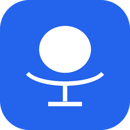

<div align="center">



# Nemotron Dictate

**Local, real-time dictation for macOS — powered by NVIDIA Nemotron, 100% on-device.**

Tap a key, speak, and your words stream into any app — *live*. No cloud, no account, no audio ever leaves your Mac.


-brightgreen)


</div>

---

## Why

Apple's dictation is cloud-tied and clunky. **Nemotron Dictate** replaces it with NVIDIA's
`nemotron-3.5-asr-streaming-0.6b` running **fully offline** on Apple Silicon — English + French,
real-time, typing straight into whatever app you're in.

## ✨ Features

- ⚡ **Real-time streaming** — words appear *as you speak* (~0.07 RTF, ~14× faster than real-time)
- 🔒 **100% local & private** — ONNX Runtime on CPU; audio never leaves your Mac; your GPU stays free
- 🎯 **Pure-append typing** — no flicker, never backspaces into your text
- 🟢 **Notch pill** — a frosted-glass "Listening" indicator under the notch, on whichever screen you're using
- 🔉 **Audio ducking** — gently lowers other apps' volume while you talk, fades it back when you finish
- ⏎ **One-key finish** — press **Enter** to stop *and* send in a single keystroke
- ⏸️ **Pause/Resume** — unload the model to free RAM whenever you want
- 🇬🇧🇫🇷 **English + French** (auto-detected) — accents and apostrophes intact

## ⬇️ Install

1. Download **`Nemotron Dictate.dmg`** from the [**Releases**](../../releases) page
2. Open it → drag the app into **Applications**
3. **Right-click → Open** (the app is unsigned — a one-time macOS Gatekeeper step)
4. Grant **Microphone**, **Accessibility**, and **Input Monitoring** when prompted
5. First launch downloads the model (~2.4 GB, one time) → you're set

> **Note:** because the app isn't notarized, macOS warns on first open — *right-click → Open* gets past it. A one-click notarized installer would need an Apple Developer ID.

## ⌨️ Use

| Action | Keys |
|---|---|
| Start dictating | **double-tap Right ⌘** |
| Stop **and** send | **Enter** |
| Just stop | double-tap Right ⌘ again |
| Language / Pause / settings | menu-bar **🎤** |

Speak → words stream into the focused app → Enter to send. That's it.

## 🧠 How it works

```
mic ─16kHz→ incremental mel ─→ ONNX encoder + RNNT decoder (cache-aware streaming)
                                          │  growing transcript (pure-append)
                                          ▼
                              live typer ─→ types only the delta into the focused app
```

- **Cache-aware streaming** RNNT — true low-latency, constant per-chunk work (incremental mel, no O(N²) re-processing)
- **ONNX Runtime (CPU)** — no PyTorch/NeMo at runtime; ~2 s cold start; leaves the GPU for other apps
- **Bulletproof mic handling** — opened only while recording, always released cleanly

## 🛠️ Build from source

```bash
uv venv && uv pip install -r requirements.txt
# run the dev menu-bar app
./.venv/bin/python live_dictate.py                 # ONNX engine (default)
./.venv/bin/python live_dictate.py --engine nemo   # NeMo/MPS (max accuracy, dev only)
# package the .app + .dmg
./.venv/bin/python app/build_app.py
```

| File | What |
|---|---|
| `app/nemotron_dictate_app.py` | packaged app entry (subclasses the live app, adds first-run download) |
| `live_dictate.py` | the menu-bar app — streaming, notch pill, ducking, pause, Enter-to-stop |
| `onnx_engine.py` | ONNX Runtime streaming engine (default; incremental mel) |
| `stream_engine.py` | NeMo/MPS streaming engine (dev / max accuracy) |
| `live_inject.py` | delta-typer (diffs growing text → minimal keystrokes) |
| `run.py` | file → text transcriber |
| `app/DISTRIBUTION.md` · `DICTATION_SETUP.md` | packaging + setup guides |

## 🙏 Credits

- **Model:** [NVIDIA `nemotron-3.5-asr-streaming-0.6b`](https://huggingface.co/nvidia/nemotron-3.5-asr-streaming-0.6b) — license **OpenMDW-1.1**
- **ONNX export:** [`altunenes/parakeet-rs`](https://huggingface.co/altunenes)
- Built with ONNX Runtime · rumps · pynput · sounddevice

## 📄 License

Code: **MIT** (see [LICENSE](LICENSE)). The model ships under its own license (OpenMDW-1.1).

<div align="center"><sub>Made on a Mac, for Macs. 🖥️</sub></div>
